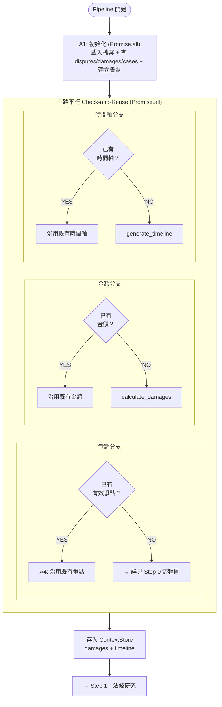
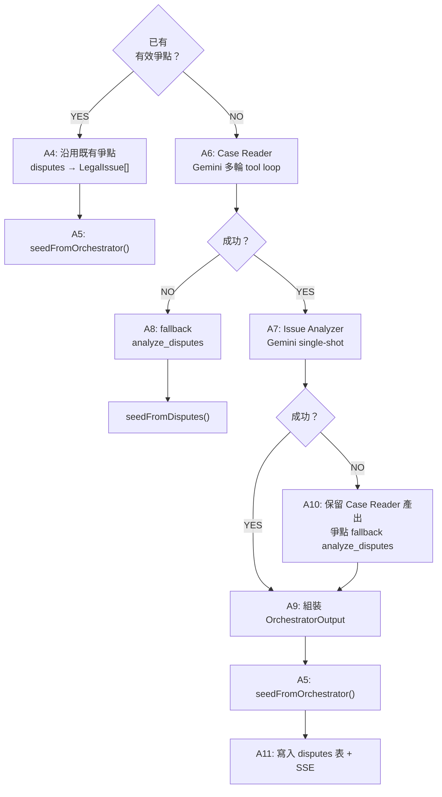
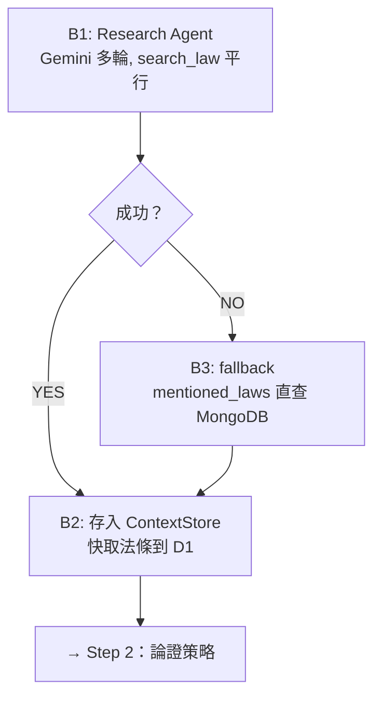
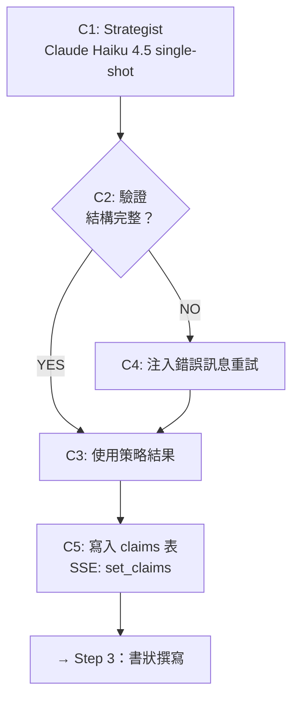
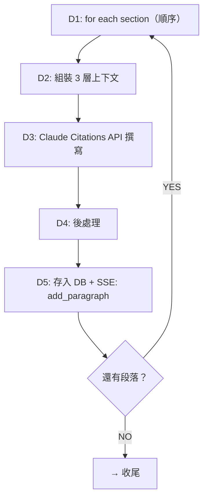
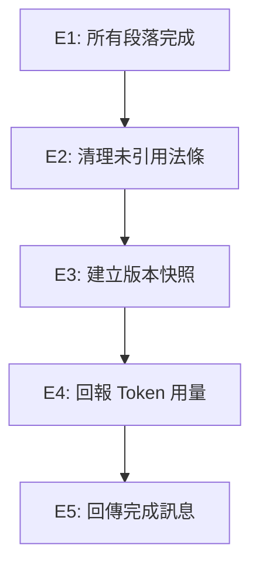

# LexDraft AI 書狀撰寫系統 — 技術文件

## 目錄

- [系統總覽](#系統總覽)
- [兩種撰寫模式](#兩種撰寫模式)
- [write_full_brief Pipeline 深入解析](#write_full_brief-pipeline-深入解析)
  - [架構總覽](#架構總覽)
  - [分步流程圖與節點說明](#分步流程圖與節點說明)
  - [ContextStore 中央資料庫](#contextstore-中央資料庫)
    - [`seedFromOrchestrator()` 詳解](#seedfromorchestrator-詳解)
    - [步驟間資料依賴總覽](#步驟間資料依賴總覽)
  - [Step 0：案件分析（Case Reader + Issue Analyzer）](#step-0案件分析case-reader--issue-analyzer)
  - [Step 1：法律研究（Research Agent）](#step-1法律研究research-agent)
  - [Step 2：論證策略（Strategist）](#step-2論證策略strategist)
  - [Step 3：段落撰寫（Writer）](#step-3段落撰寫writer)
  - [收尾工作](#收尾工作)
- [個別工具一覽](#個別工具一覽)
- [主張圖譜（Claim Graph）](#主張圖譜claim-graph)
- [Claude Citations API 引用系統](#claude-citations-api-引用系統)
- [SSE 事件與前端資料流](#sse-事件與前端資料流)
- [各 Agent 模型一覽](#各-agent-模型一覽)
- [關鍵檔案索引](#關鍵檔案索引)

---

## 系統總覽

LexDraft 的 AI 書狀撰寫系統是一套多 Agent 協作系統。使用者透過聊天介面發送指令，由 `AgentDO`（Cloudflare Durable Object）驅動多輪對話循環，調用各種工具完成分析與撰寫。

```
使用者聊天 -> POST /api/chat -> AgentDO（Durable Object）
                                    |
                              Gemini 2.5 Flash 多輪推理
                                    |
                              決定調用哪些工具
                                    |
            +-------------+---------------+--------------+
            |             |               |              |
      analyze_disputes  calculate_   generate_     write_full_brief
                        damages      timeline           |
            |             |               |        4 步 Pipeline
      set_disputes   set_damages   set_timeline   (分析->研究->策略->撰寫)
            |             |               |              |
            +-------------+---------------+--------------+
                                    |
                              SSE 即時串流
                                    |
                    前端 Zustand Stores 更新畫面
```

---

## 兩種撰寫模式

### 模式一：`write_full_brief` — 一鍵完成整份書狀

觸發方式：使用者說「幫我寫書狀」
執行完整 4 步 Pipeline（分析 -> 研究 -> 策略 -> 撰寫），自動完成整份書狀。

### 模式二：個別工具調用

Agent 在對話中根據需要自主調用單一工具（如 `analyze_disputes`、`search_law`、`write_brief_section`）。

---

## write_full_brief Pipeline 深入解析

### 架構總覽

Pipeline 由 `briefPipeline.ts` 驅動，共 4 步驟，涉及 4 個不同的 AI Agent + 1 個 Writer。

```
Step 0: Case Reader + Issue Analyzer (Gemini 2.5 Flash)
   |  0a: 讀檔案、案件摘要、重點筆記
   |  0b: 辨識爭點、事實分類、資訊缺口
   v
Step 1: Research Agent (Gemini 2.5 Flash)
   |  搜尋法條、標記攻防、評估強度
   v
Step 2: Strategist (Claude Haiku 4.5)
   |  提取主張、設計結構、分配攻防
   v
Step 3: Writer (Claude Haiku 4.5 + Citations API)
      逐段撰寫、自動引用、後處理
```

### 分步流程圖與節點說明

以下將流程圖依步驟拆分，每個步驟的流程圖後緊接其節點說明，方便對照閱讀。

#### 初始化 + 三路平行



| 編號 | 節點                     | 實際做什麼                                                                                                                                                                                                                                                                                                    | 目的                                                                                                                                                                                                       |
| ---- | ------------------------ | ------------------------------------------------------------------------------------------------------------------------------------------------------------------------------------------------------------------------------------------------------------------------------------------------------------- | ---------------------------------------------------------------------------------------------------------------------------------------------------------------------------------------------------------- |
| A1   | 初始化（`Promise.all`）  | 一次平行執行：(1) 載入所有 `status='ready'` 的檔案元資料 (2) 查 disputes 表 (3) 查 damages 表 (4) INSERT briefs 建空白書狀 + SSE 通知前端 (5) 查 cases 表拿原告/被告 + `cases.timeline` (6) 載入所有檔案全文（`full_text`/`content_md`）到 `fileContentMap` (7) 載入既有 `law_refs`（識別使用者手動加的法條） | 單次 `Promise.all` 取得所有初始資料 + 後續步驟需要的檔案全文和法條，任何查詢之間無依賴。其中 `fileContentMap` 供 Step 3 Writer Citations API 使用；`allLawRefRows` 供 Step 2 Strategist 識別使用者手動法條 |
| —    | 三路平行 Check-and-Reuse | 用 A1 撈出的記憶體變數（`existingDisputes`、`existingDamages`、`existingTimeline`）做 `if` 判斷，三者以 `Promise.all` 平行：存在就沿用，不存在就呼叫對應工具生成                                                                                                                                              | 省下不必要的 AI 呼叫，三者互不依賴可完全平行                                                                                                                                                               |

#### Step 0：案件確認（爭點分支內部）



| 編號 | 節點                       | 實際做什麼                                                                                                                    | 目的                                                                                                                                           |
| ---- | -------------------------- | ----------------------------------------------------------------------------------------------------------------------------- | ---------------------------------------------------------------------------------------------------------------------------------------------- |
| A4   | 沿用既有爭點               | 不呼叫 AI。disputes 轉為 `LegalIssue[]`，caseSummary 用檔案摘要拼接，parties 從 cases 表讀取                                  | 節省 token 費用，已有爭點不需重新分析                                                                                                          |
| A5   | seedFromOrchestrator()     | 將 caseSummary、parties、timelineSummary、legalIssues、informationGaps 一次寫入 ContextStore                                  | 統一交接點：不管走哪條路徑，後續 Step 1/2/3 都從 ContextStore 讀取                                                                             |
| A6   | Case Reader                | Gemini 多輪 tool loop：AI 自主決定讀哪些檔案（`read_file`），按優先順序讀取（起訴狀→答辯狀→準備書狀→證據），每份最多 15000 字 | 深度閱讀案件原始檔案，產出結構化摘要：caseSummary、parties、timelineSummary、每份檔案的 fileNotes（關鍵事實、提及法條、各方主張、金額）        |
| A7   | Issue Analyzer             | Gemini single-shot：輸入 Case Reader 的全部產出（caseSummary + parties + fileNotes），一次性分析                              | 從摘要中辨識法律爭點，為每個爭點產出：雙方立場、事實分類（承認/爭執/自認/推定/主張）、相關證據、提及法條，以及 informationGaps（缺少哪些證據） |
| A8   | fallback: analyze_disputes | Case Reader 失敗時，改用 `analyze_disputes` 工具（只用檔案摘要，不讀全文）                                                    | 確保即使 AI 閱讀失敗，仍能產出爭點（精度較低，無事實分類）                                                                                     |
| A9   | 組裝 OrchestratorOutput    | 合併 Case Reader 的 `{ caseSummary, parties, timelineSummary }` + Issue Analyzer 的 `{ legalIssues, informationGaps }`        | 統一格式，傳入 seedFromOrchestrator()                                                                                                          |
| A10  | fallback: 保留 parties     | Issue Analyzer 失敗時，保留 Case Reader 的 parties/summary，爭點改用 `analyze_disputes` 產生                                  | 不因 Issue Analyzer 失敗而丟失已讀取的檔案資訊                                                                                                 |
| A11  | 寫入 disputes 表           | 刪除舊爭點，插入新爭點到 D1。發送 SSE `set_disputes`（前端爭點面板）+ `set_parties`（前端原被告顯示）                         | 持久化爭點到 DB，同步更新前端 UI                                                                                                               |

#### Step 1：法條研究



| 編號 | 節點                          | 實際做什麼                                                                                                                                                       | 目的                                                                                                                  |
| ---- | ----------------------------- | ---------------------------------------------------------------------------------------------------------------------------------------------------------------- | --------------------------------------------------------------------------------------------------------------------- |
| B1   | Research Agent                | Gemini 多輪 tool loop：輸入 legalIssues + caseSummary + briefType。AI 自主決定搜什麼（`search_law` 查 MongoDB 22 萬條法條），同一輪可平行搜多條（`Promise.all`） | 為每個爭點找到相關法條，標記攻防（attack/defense_risk/reference），評估爭點法律強度（strong/moderate/weak/untenable） |
| B2   | 存入 ContextStore + 快取法條  | `store.research = 結果`；找到的法條用 `upsertManyLawRefs()` 快取到 D1 的 `law_refs` JSON 欄位                                                                    | 供 Step 2 Strategist 和 Step 3 Writer 使用；快取避免後續重複查 MongoDB                                                |
| B3   | fallback: mentioned_laws 直查 | Research Agent 失敗時，直接用爭點的 `mentioned_laws` 和爭點標題作為查詢字串搜 MongoDB                                                                            | 確保至少有法條可用（但不經 AI 判斷攻防，全標為 attack，精度較低）                                                     |

#### Step 2：論證策略



| 編號 | 節點                 | 實際做什麼                                                                                                              | 目的                                                                                                                                                                            |
| ---- | -------------------- | ----------------------------------------------------------------------------------------------------------------------- | ------------------------------------------------------------------------------------------------------------------------------------------------------------------------------- |
| C1   | Strategist           | Claude Haiku 4.5 single-shot：輸入爭點 + 法條研究結果 + 檔案摘要 + 金額明細 + 時間軸 + 使用者手動法條 + informationGaps | 設計書狀論證結構。產出 (1) Claims 主張圖譜：雙方主張、攻防配對（responds_to）、分配到段落 (2) Sections 段落規劃：每段的論證框架（法律依據 + 事實涵攝 + 結論）、要用的法條和檔案 |
| C2   | 驗證結構完整？       | `validateStrategyOutput()` 檢查：claims 結構是否完整、sections 引用的 claims 是否存在、覆蓋率是否足夠                   | 防止 AI 產出殘缺的策略（如 claim 沒分配到段落、對方主張沒有反駁）                                                                                                               |
| C3   | 使用策略結果         | 驗證通過，直接使用                                                                                                      | —                                                                                                                                                                               |
| C4   | 注入錯誤訊息重試     | 將具體的驗證錯誤（如「our_claim_3 沒有 assigned_section」）注入 prompt，讓 AI 修正                                      | 給 AI 精確的修正指示，而非重新生成整份策略（最多重試 1 次）                                                                                                                     |
| C5   | 寫入 claims 表 + SSE | `store.setStrategyOutput(claims, sections)`；Claims 寫入 D1（分批 10 筆避免參數上限）；SSE `set_claims` 通知前端        | 持久化主張圖譜，前端可以顯示攻防關係圖                                                                                                                                          |

#### Step 3：書狀撰寫



| 編號 | 節點                      | 實際做什麼                                                                                                                                                                              | 目的                                                                       |
| ---- | ------------------------- | --------------------------------------------------------------------------------------------------------------------------------------------------------------------------------------- | -------------------------------------------------------------------------- |
| D1   | for each section（順序）  | 依序處理 Strategist 規劃的每個 section                                                                                                                                                  | 不能平行：後面段落的「回顧層」需要前面段落的全文，才能維持前後一致性       |
| D2   | 組裝 3 層上下文           | `getContextForSection(i)` 組裝：**背景層**（caseSummary + 完整大綱標記當前段）、**焦點層**（本段 claims + 論證框架 + 法條全文 + 檔案內容 + 事實運用指示）、**回顧層**（已完成段落全文） | 給 Writer 恰好足夠的上下文：知道全局位置、聚焦當前任務、避免與前文重複     |
| D3   | Claude Citations API 撰寫 | 將法條和檔案分塊後作為 `document` block 傳入 Claude，Claude 撰寫時自動標記引用位置（引用了哪份文件的哪一段原文）                                                                        | 產出帶有精確引用的法律段落，每段 150-400 字                                |
| D4   | 後處理                    | (1) 去除 Claude 重複輸出的章節標題 (2) 掃描文中提到但沒被 Citation 標記的法條 (3) 從 MongoDB 補查這些法條並快取                                                                         | 確保引用完整性：Claude 有時文中寫了「民法第 184 條」但沒從 document 中引用 |
| D5   | 存入 DB + SSE             | 段落存入 `briefs.content_structured`；SSE `add_paragraph` 讓前端即時顯示新段落；`store.addDraftSection()` 記錄全文供下一段回顧層用                                                      | 即時更新前端 + 為下一段提供上下文                                          |

#### 收尾



| 編號 | 節點            | 實際做什麼                                                                                                     | 目的                                                                       |
| ---- | --------------- | -------------------------------------------------------------------------------------------------------------- | -------------------------------------------------------------------------- |
| E1   | 所有段落完成    | Writer 迴圈結束                                                                                                | —                                                                          |
| E2   | 清理未引用法條  | 刪除研究過但最終沒被書狀引用的法條（保留使用者手動加的 `is_manual=true`）；SSE `set_law_refs` 更新前端法條面板 | 前端法條面板只顯示書狀實際用到的法條，不顯示 Research 階段試搜過但沒用上的 |
| E3   | 建立版本快照    | 將完成的書狀存入 `brief_versions` 表，label: `'AI 撰寫完成（X 段）'`                                           | 支援版本回溯，使用者可以恢復到 AI 剛寫完的版本                             |
| E4   | 回報 Token 用量 | 累計所有 Claude 呼叫的 input/output tokens，估算 NTD 成本；SSE `usage` 通知前端                                | 使用者可以看到這次撰寫花了多少 token/費用                                  |
| E5   | 回傳完成訊息    | 回傳文字：段落數、我方/對方主張數、失敗段落列表（如有）                                                        | 讓 AgentDO 的對話紀錄中有最終結果摘要                                      |

### 為什麼 0a 和 0b 不拆成兩個 Step

前端進度 UI 只有 4 格：`案件確認 → 法條研究 → 論證策略 → 書狀撰寫`。0a（Case Reader）和 0b（Issue Analyzer）是同一個邏輯階段「理解案件」的兩個子任務，合在一個進度格內用子進度（children）顯示細節：

```
[running] 案件確認
  閱讀 起訴狀.pdf [done]
  閱讀 答辯狀.pdf [done]
  案件摘要 [done]
  爭點分析 [running]     ← 0b 開始
```

拆成兩個 Step 的問題：

- 使用者看到 5 格進度條，但「閱讀檔案」和「分析爭點」對使用者來說都是「AI 在看我的案件」，拆開反而增加認知負擔
- 0b 的輸入完全依賴 0a 的輸出（`caseSummary + parties + fileNotes`），沒有獨立執行的意義
- 當沿用既有爭點時，整個 Step 0 直接跳過，一個 Step 比兩個好處理

### 平行 vs 順序執行

| 位置                        | 執行方式               | 說明                                                                |
| --------------------------- | ---------------------- | ------------------------------------------------------------------- |
| Step 0 初始化（A1）         | **平行** `Promise.all` | 載入檔案 + 查 disputes/damages/cases + 建立書狀，全部同時執行       |
| Step 0 三路 Check-and-Reuse | **平行** `Promise.all` | 用 A1 結果判斷，爭點/金額/時間軸三者互不依賴，完全平行檢查與生成    |
| Step 0 Case Reader 內部     | **順序**               | 多輪對話，每輪等 AI 回應後才執行工具                                |
| Step 0 → Step 1             | **順序**               | Step 1 需要 Step 0 的 legalIssues                                   |
| Step 1 Research Agent 內部  | **同輪平行**           | Gemini 同一輪發出多個 `search_law`，以 `Promise.all` 平行查 MongoDB |
| Step 1 跨輪                 | **順序**               | 每輪等 AI 決定下一步才繼續                                          |
| Step 1 → Step 2             | **順序**               | Step 2 需要 Step 1 的 research 結果                                 |
| Step 2 → Step 3             | **順序**               | Step 3 需要 Step 2 的 claims + sections                             |
| Step 3 各段落之間           | **順序**               | 後面段落的「回顧層」需要前面段落的全文，無法平行                    |

簡單來說：**步驟之間全部順序**（有資料依賴），**步驟內部的 I/O 操作盡量平行**。

### ContextStore 中央資料庫

各步驟之間透過 `ContextStore`（`contextStore.ts`）傳遞資料。

**重要：ContextStore 不是 Durable Object 的物件。** 它是一個純 JavaScript class（`new ContextStore()`），在 `briefPipeline.ts:124` 建立。生命週期 = 一次 `runBriefPipeline()` 的執行，Pipeline 結束後就被 GC 回收，不持久化。它和 AgentDO 的關係是：AgentDO 呼叫 `write_full_brief` 工具 → 工具內部呼叫 `runBriefPipeline()` → Pipeline 內建立 ContextStore。

**資料流模式：Pipeline 編排代碼寫入，Pipeline 編排代碼讀出。** 不是 AI Agent 自己去存取 ContextStore，而是 `briefPipeline.ts` 的編排邏輯負責：(1) 執行某個 Agent → (2) 拿到 Agent 的輸出 → (3) 寫入 ContextStore → (4) 從 ContextStore 讀出資料 → (5) 組裝成 prompt 傳給下一個 Agent。AI 本身看不到 ContextStore。

```
ContextStore（生命週期 = 一次 Pipeline 執行）
│
├── Step 0 寫入 ──────────────────────────────────
│   caseSummary: string        案件摘要（< 500 字）
│   parties: { plaintiff, defendant }
│   timelineSummary: string    時間軸摘要
│   briefType: string          書狀類型
│   legalIssues: LegalIssue[]  爭點列表（含事實分類、mentioned_laws）
│   informationGaps: InformationGap[]  資訊缺口
│   damages: DamageItem[]      金額明細（category + description + amount）
│   timeline: TimelineItem[]   時間軸事件（date + title + description + is_critical）
│
├── Step 1 寫入 ──────────────────────────────────
│   research: ResearchResult[] 每個爭點的法律研究結果
│     └── found_laws: FoundLaw[]  找到的法條（含 side 攻防標記）
│
├── Step 2 寫入 ──────────────────────────────────
│   claims: Claim[]            主張圖譜（雙方所有 claims）
│   sections: StrategySection[] 段落規劃（論證框架、分配的 claims）
│
└── Step 3 逐段寫入 ──────────────────────────────
    draftSections: DraftSection[] 已完成段落的全文
      └── 每寫完一段 push 一筆，供下一段的「回顧層」使用
```

**查詢方法**（下游步驟透過這些方法讀取上游資料）：

| 方法                      | 呼叫者        | 用途                                           |
| ------------------------- | ------------- | ---------------------------------------------- |
| `getUnrebutted()`         | Step 2 驗證   | 找出對方尚未被反駁的主張                       |
| `getAllFoundLaws()`       | Step 3 Writer | 取得所有法條，篩選本段需要的                   |
| `getContextForSection(i)` | Step 3 Writer | 組裝第 i 段的 3 層上下文（背景 + 焦點 + 回顧） |

**寫入方法**：

| 方法                                  | 呼叫者          | 作用                                                    |
| ------------------------------------- | --------------- | ------------------------------------------------------- |
| `seedFromOrchestrator(output)`        | Step 0          | 寫入 caseSummary, parties, legalIssues, informationGaps |
| `seedFromDisputes(list)`              | Step 0 fallback | 從既有 disputes 轉為 legalIssues（精度較低）            |
| `setStrategyOutput(claims, sections)` | Step 2          | 寫入 claims + sections                                  |
| `addDraftSection(draft)`              | Step 3          | 逐段追加已完成段落                                      |

#### `seedFromOrchestrator()` 詳解

`seedFromOrchestrator` 是 Step 0 和後續步驟之間的「交接點」，將 Step 0 的產出一次性灌入 ContextStore（`contextStore.ts:111-117`）：

```typescript
seedFromOrchestrator = (output: OrchestratorOutput) => {
  this.caseSummary = output.caseSummary; // 案件摘要
  this.parties = output.parties; // 原告/被告
  this.timelineSummary = output.timelineSummary; // 時間軸
  this.legalIssues = output.legalIssues; // 爭點列表
  this.informationGaps = output.informationGaps; // 資訊缺口
};
```

**兩個進入點都會呼叫此方法：**

| 路徑     | 觸發條件        | OrchestratorOutput 的來源                          | 呼叫位置               |
| -------- | --------------- | -------------------------------------------------- | ---------------------- |
| 完整路徑 | DB 沒有既有爭點 | CaseReaderOutput + IssueAnalyzerOutput 組裝        | `briefPipeline.ts:319` |
| 跳過路徑 | DB 已有有效爭點 | disputes 表 + cases 表 + 檔案摘要拼接（不呼叫 AI） | `briefPipeline.ts:207` |

**對比 `seedFromDisputes()`**（`contextStore.ts:91-108`）：這是 Case Reader 完全失敗時的 fallback，只填 `legalIssues`（從 disputes 表轉換），**不填** caseSummary、parties、timelineSummary、informationGaps，精度較低。

#### 步驟間資料依賴總覽

每個步驟執行時，從 ContextStore（及 DB）取得的具體資料：

**Step 0 → Step 1（Research Agent）的輸入**（`briefPipeline.ts:470-483`）：

| 資料欄位                       | 來源                | 用途                              |
| ------------------------------ | ------------------- | --------------------------------- |
| `legalIssues[].id`             | Step 0 ContextStore | 研究結果關聯回爭點                |
| `legalIssues[].title`          | Step 0 ContextStore | AI 理解爭點主題                   |
| `legalIssues[].our_position`   | Step 0 ContextStore | AI 知道我方立場以搜尋攻擊法條     |
| `legalIssues[].their_position` | Step 0 ContextStore | AI 知道對方立場以搜尋防禦風險法條 |
| `legalIssues[].mentioned_laws` | Step 0 ContextStore | AI 優先搜尋這些法條（直接命中）   |
| `caseSummary`（截斷 4000 字）  | Step 0 ContextStore | AI 理解案件背景                   |
| `briefType`                    | 使用者指定          | 決定研究策略方向                  |

**Step 0 + Step 1 → Step 2（Strategist）的輸入**（由 `buildStrategistInput()` 組裝）：

| 資料欄位                    | 來源                          | 用途                             |
| --------------------------- | ----------------------------- | -------------------------------- |
| `caseSummary`               | Step 0 → ContextStore         | 案件全貌                         |
| `briefType`                 | 使用者指定                    | 決定書狀結構慣例                 |
| `legalIssues[]`（含 facts） | Step 0 → ContextStore         | 爭點清單、事實分類               |
| `research[].found_laws`     | **Step 1** → ContextStore     | 每個爭點找到的法條               |
| `research[].strength`       | **Step 1** → ContextStore     | 爭點強度評估                     |
| `research[].attack_points`  | **Step 1** → ContextStore     | 攻擊要點                         |
| `research[].defense_risks`  | **Step 1** → ContextStore     | 防禦風險                         |
| `informationGaps[]`         | Step 0 → ContextStore         | 決定哪些論點要保守               |
| `fileSummaries`             | DB readyFiles                 | 檔案摘要（選擇引用哪些檔案）     |
| `damages`                   | Step 0 → ContextStore         | 金額計算（起訴狀需要）           |
| `userAddedLaws`             | DB law_refs（is_manual=true） | 使用者手動加入的法條             |
| `timeline`                  | Step 0 → ContextStore         | 時間軸事件（建立因果、判斷時效） |

**Step 0 + Step 1 + Step 2 → Step 3（Writer）的輸入**（由 `getContextForSection(i)` 組裝）：

| 資料欄位                                      | 來源                                                                  | 用途                             |
| --------------------------------------------- | --------------------------------------------------------------------- | -------------------------------- |
| **背景層**                                    |                                                                       |                                  |
| `caseSummary`                                 | Step 0 → ContextStore                                                 | 案情摘要                         |
| `briefType`                                   | 使用者指定                                                            | 文書風格                         |
| `fullOutline`（所有段落標題 + 標記當前段）    | **Step 2** → `store.sections`                                         | 完整大綱，讓 AI 知道自己在寫哪裡 |
| **焦點層**                                    |                                                                       |                                  |
| `claims`（本段負責的主張）                    | **Step 2** → `store.claims` filtered by `assigned_section`            | 本段要論述的 claims              |
| `argumentation`（法律依據 + 事實涵攝 + 結論） | **Step 2** → `section.argumentation`                                  | 論證框架                         |
| `laws`（相關法條全文）                        | **Step 1** → `store.getAllFoundLaws()` filtered by `relevant_law_ids` | Claude 引用的法條文件            |
| `fileIds`（相關檔案 ID）                      | **Step 2** → `section.relevant_file_ids`                              | Claude 引用的案件文件            |
| `factsToUse`（事實運用指示）                  | **Step 2** → `section.facts_to_use`                                   | 每個事實的 assertion_type 和用法 |
| **回顧層**                                    |                                                                       |                                  |
| `completedSections`（已完成段落全文）         | **Step 3 前面的段落** → `store.draftSections.slice(0, i)`             | 維持前後一致性、避免重複         |

---

### Step 0：案件分析（Case Reader + Issue Analyzer）

**檔案位置**：`src/server/agent/orchestratorAgent.ts`、`src/server/agent/prompts/orchestratorPrompt.ts`

Step 0 由兩個 Agent 組成，在同一個進度步驟內以子進度顯示：

#### Agent 0a: Case Reader（案件摘要）

| 項目     | 值                                             |
| -------- | ---------------------------------------------- |
| AI 模型  | Gemini 2.5 Flash（透過 Cloudflare AI Gateway） |
| 可用工具 | `read_file`、`list_files`                      |
| 最多輪數 | 8 輪                                           |
| 最多讀檔 | 6 份                                           |
| 超時     | 90 秒                                          |
| 呼叫方式 | 多輪工具呼叫（streaming）                      |

**為什麼需要多輪？**

Case Reader 是一個**工具呼叫循環（tool-calling loop）**，AI 需要自主決定讀哪些檔案、讀幾份、以什麼順序讀：

1. 系統 prompt 告訴 AI 有哪些檔案（ID + 摘要），並給出閱讀優先順序策略
2. AI **第一輪**可能呼叫 `read_file` 讀起訴狀 → 拿到全文（最多 15000 字）
3. AI **第二輪**讀了起訴狀後發現有提到答辯狀的論點，決定再讀答辯狀 → 呼叫 `read_file`
4. AI **第三輪**可能想讀證據清單 → 呼叫 `read_file`
5. AI 覺得讀夠了 → **不再呼叫工具**，直接輸出 JSON 結果（觸發退出迴圈）

為什麼不一次讀完所有檔案？

- **Token 成本控制**：每份檔案全文可能 15000 字，一次讀 6 份 = 90000 字 token 會爆
- **智慧選擇**：AI 可以根據前幾份的內容決定後面需不需要讀，省下不必要的 token
- **相關性篩選**：有些檔案（如收據、照片說明）可能與爭點無關，不需要讀

退出條件：AI 回應中不包含任何 tool call → 解析最後一輪的文字內容為 JSON 結果。若 JSON 解析失敗，會注入修正 prompt 讓 AI 重試一次（`orchestratorAgent.ts:152-164`）。

**執行流程**：

1. 初始化（單一 `Promise.all`）：同時載入檔案元資料、查詢 disputes/damages/cases（含 timeline）、建立空白書狀
2. 三路平行 Check-and-Reuse（`Promise.all`）：用步驟 1 撈出的資料判斷，爭點、金額、時間軸三者同時檢查是否已存在，不存在則自動生成（詳見「三路平行 Check-and-Reuse 機制」段落）
3. 若爭點分支需要生成，啟動 Case Reader 多輪循環：
   - 系統提示告訴 AI 閱讀策略：起訴狀/聲請狀 -> 答辯狀 -> 準備書狀 -> 證據清單 -> 其他
   - AI 自主決定讀哪些檔案（呼叫 `read_file`），每讀一份前端顯示子進度
   - AI 跳過重複讀取（同一檔案不會讀第二次）
   - 讀完後 AI 直接輸出 JSON 結果（不含爭點分析）

**輸出結構**：

```json
{
  "case_summary": "< 500 字案情摘要",
  "parties": {
    "plaintiff": "原告姓名+角色描述",
    "defendant": "被告姓名+角色描述"
  },
  "timeline_summary": "< 800 字時間軸摘要",
  "file_notes": [
    {
      "filename": "起訴狀.pdf",
      "key_facts": ["原告於111年3月15日遭被告車輛撞傷", "事發地點為台北市中正區"],
      "mentioned_laws": ["民法第184條", "民法第195條"],
      "claims": ["原告主張被告超速行駛", "被告主張原告闖紅燈"],
      "key_amounts": ["醫療費用15萬元", "精神慰撫金50萬元"]
    }
  ]
}
```

**`file_notes` 說明**：Case Reader 讀完檔案後產出的結構化筆記（`FileNote[]`），每份檔案一個物件，包含關鍵事實、提及法條、各方主張、關鍵金額。此結構化格式確保：

- **法條名稱不會在壓縮過程中遺失**（`mentioned_laws` 獨立欄位）
- **Issue Analyzer 能直接引用具體事實和法條**
- 透過 `formatFileNotes()` 轉為文字後傳入 Issue Analyzer

#### Agent 0b: Issue Analyzer（爭點分析）

| 項目     | 值                                             |
| -------- | ---------------------------------------------- |
| AI 模型  | Gemini 2.5 Flash（透過 Cloudflare AI Gateway） |
| 可用工具 | 無                                             |
| 輪數     | 1 輪（single-shot）                            |
| 超時     | 60 秒                                          |
| 呼叫方式 | `callAI`（non-streaming，支援 AbortSignal）    |

**輸入**：case_summary + parties + timeline_summary + file_notes（結構化 `FileNote[]` 經 `formatFileNotes()` 格式化為文字）+ briefType（全部來自 Case Reader 的輸出）

**強化的 Prompt 要求**：

- `our_position`/`their_position` 必須包含具體事實（人事時地金額），不能只是抽象法律概念
- `mentioned_laws` 每個爭點至少填 1 條：優先使用 file_notes 中的 `mentioned_laws`，否則根據爭點性質推論
- 這些具體資訊會直接傳給 Research Agent，確保搜尋查詢有效

**輸出結構**：

```json
{
  "legal_issues": [
    {
      "title": "爭點標題",
      "our_position": "我方主張",
      "their_position": "對方主張",
      "key_evidence": ["關鍵證據1", "關鍵證據2"],
      "mentioned_laws": ["相關法條1"],
      "facts": [
        {
          "description": "事實描述",
          "assertion_type": "承認 | 爭執 | 自認 | 推定 | 主張",
          "source_side": "我方 | 對方 | 中立",
          "evidence": ["證據名稱"],
          "disputed_by_description": "（若為爭執）對方如何反駁"
        }
      ]
    }
  ],
  "information_gaps": [
    {
      "severity": "critical | nice_to_have",
      "description": "缺少什麼資訊",
      "related_issue_index": 0,
      "suggestion": "建議如何補充"
    }
  ]
}
```

#### 事實分類標準（assertion_type）

| 類型 | 說明                                       |
| ---- | ------------------------------------------ |
| 承認 | 雙方都不爭執的事實（如事故發生日期）       |
| 爭執 | 一方主張另一方否認（如過失比例、金額計算） |
| 自認 | 對方在書狀中自行承認的事實（對我方有利）   |
| 推定 | 法律上推定為真的事實（如過失推定）         |
| 主張 | 一方單方面主張但尚未獲對方回應             |

#### 進度 UI 顯示

```
閱讀 起訴狀.pdf [done]
閱讀 答辯狀.pdf [done]
案件摘要 [done]
爭點分析 [running]
```

#### 完成後的處理

- 組裝 `OrchestratorOutput`（= CaseReaderOutput + IssueAnalyzerOutput）
- 將爭點寫入 `disputes` 表（刪舊插新）
- 發送 SSE `set_disputes` 和 `set_parties` 給前端
- 結果存入 `ContextStore`（`store.seedFromOrchestrator()`）
- 檔案全文（`fileContentMap`）和既有法條（`allLawRefRows`）已在 A1 初始化時一併載入，無需額外查詢

#### 三路平行 Check-and-Reuse 機制（節省 Token）

Step 0 的初始 DB 查詢完成後，爭點、金額、時間軸三者以 `Promise.all` **完全平行**執行 check-and-reuse：

**爭點分支：**

- 若 DB 已有有效爭點（`disputes` 表有資料且 `our_position`/`their_position` 非空）→ 跳過 Case Reader + Issue Analyzer，直接沿用
- 若無 → 執行完整 Case Reader + Issue Analyzer 流程

**金額分支：**

- 若 DB 已有金額（`damages` 表有資料）→ 直接沿用，進度 UI 顯示「沿用既有金額 [done]」
- 若無 → 呼叫 `calculate_damages` 工具自動生成，完成後從 DB 重新載入

**時間軸分支：**

- 若 DB 已有時間軸（`cases.timeline` JSON 欄位非空陣列）→ 直接沿用，進度 UI 顯示「沿用既有時間軸 [done]」
- 若無 → 呼叫 `generate_timeline` 工具自動生成，完成後從 DB 重新載入

三者完成後，金額和時間軸存入 `ContextStore`（`store.damages`、`store.timeline`），供 Step 2 Strategist 使用。

#### 容錯機制

兩個 fallback 路徑共用 `fallbackToAnalyzeDisputes()` helper（避免重複邏輯）：

- **Case Reader 失敗** → 整個 Step 0 fallback 到 `analyze_disputes` 工具（`store.seedFromDisputes()`）
- **Issue Analyzer 失敗** → 保留 Case Reader 產出的 parties/summary，爭點 fallback 到 `analyze_disputes`

---

### Step 1：法律研究（Research Agent）

**檔案位置**：`src/server/agent/researchAgent.ts`、`src/server/agent/prompts/researchAgentPrompt.ts`

| 項目     | 值                                                              |
| -------- | --------------------------------------------------------------- |
| AI 模型  | Gemini 2.5 Flash                                                |
| 可用工具 | `search_law`（搜尋 MongoDB Atlas Search，22 萬條法條）          |
| 最多輪數 | 10 輪                                                           |
| 最多搜尋 | 20 次                                                           |
| 超時     | 60 秒                                                           |
| 工具執行 | **平行**（同一輪多個 search_law 呼叫以 `Promise.all` 並發執行） |

#### 研究策略（由 AI 自主決定，按優先順序）

1. **具體條號優先**（最快、最精準）：先搜 `mentioned_laws` 中的具體條號（如「民法第184條」），再根據案型補搜常用法條
2. **法規+概念**（擴展搜尋）：搜「民法 損害賠償」等，概念關鍵字必須用法條原文用語
3. **防禦法條**（預判對方攻防）：搜對方可能引用的法條，如與有過失（民法第217條）、時效抗辯等

#### 平行工具呼叫

Gemini 經常在一輪中同時發出多個 `search_law` 呼叫（例如一次搜 6 條法條）。系統處理方式：

1. **SSE 串流解析**（`sseParser.ts`）：Gemini 透過 AI Gateway compat endpoint 送出的平行 tool calls 可能共用同一個 streaming index，導致多個 JSON arguments 被串接成 `{…}{…}{…}`。`splitConcatenatedJson()` 負責用 brace depth tracking 將其拆分為獨立的 tool calls。
2. **平行執行**（`researchAgent.ts`）：拆分後的多個 tool calls 以 `Promise.all` 平行查詢 MongoDB，共用同一個 `lawSession` 連線，全部完成後一次 push 回 messages。

#### 搜尋關鍵字規則

搜尋引擎是 keyword match（smartcn 中文分詞），不是語意搜尋，關鍵字選擇很重要：

- 關鍵字越短越好（2-4 字），不要用複合詞
- 「法規名稱 + 短概念」比「純概念」精準得多
- 搜不到時拆短重搜，不要加長
- 縮寫會自動展開：消保法、勞基法、個資法、國賠法、民訴法、刑訴法、道交條例、道安規則等

常見案型有預設必搜法條清單（見 `researchAgentPrompt.ts`），確保核心條文不遺漏。

#### 攻防標記（side）

| 標記           | 說明                                                         |
| -------------- | ------------------------------------------------------------ |
| `attack`       | 支持我方主張的法條                                           |
| `defense_risk` | 對方可能用來反駁的法條（必須實際搜尋過，不可僅在分析中提及） |
| `reference`    | 背景參考                                                     |

#### 爭點強度評估（strength）

| 強度        | 說明                           |
| ----------- | ------------------------------ |
| `strong`    | 有明確法律依據 + 強事實支撐    |
| `moderate`  | 有法律依據但事實或證據有弱點   |
| `weak`      | 法律依據薄弱或事實不利         |
| `untenable` | 站不住腳，建議律師重新考慮策略 |

#### 完成條件（每個爭點獨立判斷）

1. 至少找到 1 條 attack 法條
2. 至少搜尋過 1 條 defense_risk 法條
3. 構成要件可與事實對應

三個條件都滿足 -> 該議題完成 | 任一不滿足 -> 繼續查（每個議題最多 5 輪）

#### 輸出結構

```json
{
  "research": [
    {
      "issue_id": "爭點ID",
      "strength": "strong",
      "found_laws": [
        {
          "id": "A0000001-第184條",
          "law_name": "民法",
          "article_no": "第 184 條",
          "content": "條文內容...",
          "relevance": "與本爭點的關聯說明",
          "side": "attack"
        }
      ],
      "analysis": "整體分析...",
      "attack_points": ["攻擊要點1", "攻擊要點2"],
      "defense_risks": ["防禦風險1"]
    }
  ]
}
```

#### 完成後的處理

- 找到的法條快取到案件的 `law_refs` JSON 欄位（`upsertManyLawRefs()`）
- 結果存入 `ContextStore`（`store.research`）

#### 特殊機制

- 使用 `createLawSearchSession()` 建立共享 MongoDB 連線（整個研究過程只開一次，最後 `finally` 關閉）
- 驗證 `defense_risk` 法條確實有被搜尋過，否則降級為 `reference`

#### 容錯機制

- **Research Agent 失敗**時：在進度 UI 顯示錯誤原因（可展開查看詳情），然後 fallback 到 `fallbackResearchFromMentionedLaws()`
- **`fallbackResearchFromMentionedLaws()`**：從爭點的 `mentioned_laws` 直接搜尋 MongoDB，為每個爭點找到相關法條。若 `mentioned_laws` 為空，則用爭點標題作為搜尋查詢
- fallback 結果會正常存入 ContextStore，後續 Strategist 和 Writer 不受影響

---

### Step 2：論證策略（Strategist）

**檔案位置**：`src/server/agent/pipeline/strategyStep.ts`、`src/server/agent/prompts/strategistPrompt.ts`

| 項目       | 值                                             |
| ---------- | ---------------------------------------------- |
| AI 模型    | Claude Haiku 4.5（透過 Cloudflare AI Gateway） |
| 工具呼叫   | 無（單次 JSON 輸出）                           |
| max_tokens | 16384                                          |

#### 輸入資料（由 `buildStrategistInput()` 組裝）

- 案件全貌（Step 0 的 caseSummary）
- 書狀類型
- 爭點清單（含事實分類）
- 法律研究結果（含攻防標記、強度、攻擊要點、防禦風險）
- 案件檔案摘要
- Information Gaps
- 使用者手動加入的法條
- 損害賠償金額明細
- 時間軸事件列表（★ 標記關鍵事件，用於建立因果關係、確認時效）

#### 角色定位

> 你負責「決定用什麼牌、怎麼排」，Writer 負責「怎麼用文字表達」。

- 該做：提取主張、選擇法條、排列論點順序、安排攻防、分配 claim
- 不該做：撰寫具體文字、給寫作風格指示

#### 輸出 Part 1：Claims（主張圖譜）

每個 Claim 包含：

| 欄位               | 說明                                                        |
| ------------------ | ----------------------------------------------------------- |
| `id`               | 如 their_claim_1、our_claim_1                               |
| `side`             | `ours`（我方）或 `theirs`（對方）                           |
| `claim_type`       | `primary`（主要）/ `rebuttal`（反駁）/ `supporting`（輔助） |
| `statement`        | 一句話描述                                                  |
| `assigned_section` | 分配到哪個段落（ours 必填，theirs 為 null）                 |
| `dispute_id`       | 關聯哪個爭點                                                |
| `responds_to`      | 回應/輔助哪個 claim（rebuttal + supporting 必填）           |

規則：

- 每個 `ours` claim 必須有 `assigned_section`
- `theirs` claim 的 `assigned_section` 為 null（由 ours claim 在對應段落中回應）
- `rebuttal` 必須有 `responds_to`（指向被反駁的 claim）
- `supporting` 必須有 `responds_to`（指向它輔助的 primary claim）
- `primary` 的 `responds_to` 為 null
- 對方每個主要主張都需要有 ours claim 來回應

#### 輸出 Part 2：Sections（段落規劃）

每個 Section 包含：

| 欄位                             | 說明                                     |
| -------------------------------- | ---------------------------------------- |
| `id`                             | section_1, section_2...                  |
| `section`                        | 壹、前言                                 |
| `subsection`                     | 一、關於貨物瑕疵（可選）                 |
| `dispute_id`                     | 關聯哪個爭點（可選）                     |
| `argumentation.legal_basis`      | 引用的法條 ID 列表                       |
| `argumentation.fact_application` | 事實如何涵攝到法律要件                   |
| `argumentation.conclusion`       | 本段小結論                               |
| `claims[]`                       | 本段負責的 claim ID 列表                 |
| `relevant_file_ids[]`            | 需要引用的檔案 ID                        |
| `relevant_law_ids[]`             | 需要引用的法條 ID                        |
| `facts_to_use[]`                 | 要運用的事實（含 assertion_type 和用法） |

#### 書狀結構慣例

| 書狀類型                    | 結構                                                    |
| --------------------------- | ------------------------------------------------------- |
| 民事起訴狀（complaint）     | 前言 -> 事實及理由（依爭點展開）-> 請求金額計算 -> 結論 |
| 民事答辯狀（defense）       | 前言 -> 逐一反駁原告主張 -> 結論                        |
| 民事準備書狀（preparation） | 前言 -> 逐一反駁對方攻防 -> 補充論述 -> 結論            |
| 上訴狀（appeal）            | 前言 -> 原判決違誤之處 -> 上訴理由 -> 結論              |

#### 事實運用規則

| assertion_type | 撰寫策略                   |
| -------------- | -------------------------- |
| 承認           | 直接援引，不需花篇幅論證   |
| 爭執           | 需重點論證，提出證據佐證   |
| 自認           | 明確援引對方書狀中的自認   |
| 推定           | 援引法律推定，轉移舉證責任 |

#### Information Gaps 處理

- `critical` 級別：避開沒有證據支撐的論點或使用保守措辭
- `nice_to_have` 級別：正常設計但備註可強化
- 不會腦補不存在的事實或證據

#### 驗證機制（`validateStrategy.ts`）

- 驗證 claims 結構完整性
- 驗證 sections 引用的 claims 存在
- 驗證覆蓋率（`claim_coverage_check`）
- 失敗時注入錯誤訊息讓 LLM 修正（最多重試 1 次）

#### 完成後的處理

- Claims 寫入 `claims` 表（刪舊插新，每 10 筆一批以避免 D1 的 ~100 bound parameter 上限）
- 發送 SSE `set_claims` 給前端
- 結果存入 `ContextStore`（`store.setStrategyOutput()`）

---

### Step 3：段落撰寫（Writer）

**檔案位置**：`src/server/agent/pipeline/writerStep.ts`、`src/server/agent/claudeClient.ts`

| 項目       | 值                                   |
| ---------- | ------------------------------------ |
| AI 模型    | Claude Haiku 4.5 + Citations API     |
| 呼叫方式   | 逐段撰寫，每個 section 一次 API 呼叫 |
| max_tokens | 4096                                 |

#### 3.1 準備上下文（`ContextStore.getContextForSection()`）

Writer 拿到 **3 層上下文**：

**背景層**：

- 書狀類型、案情摘要
- 完整大綱（所有段落標題，標記「你正在寫這段」）

**焦點層**（只有本段需要的）：

- 本段負責的 claims（含攻防配對關係）
- 論證框架（法律依據 + 事實涵攝 + 結論）
- 相關法條全文
- 相關檔案內容（content_md 優先，fallback 到 full_text，截斷 20000 字）
- 事實運用指示

**回顧層**：

- 已完成段落的全文（維持前後一致性）

#### 3.2 建構 Claude Documents

```
Document 1: 起訴狀.pdf（分塊）  -> citations: enabled
Document 2: 證據清單.pdf（分塊）  -> citations: enabled
Document 3: 民法 第184條          -> citations: enabled
Document 4: 民法 第195條          -> citations: enabled
[instruction text]: 撰寫指示
```

分塊策略（`chunkContent()`）：

- 優先按 `##` Markdown 標題切分
- 否則按 `。` 句點切分（`splitBySentence()`）
- 每塊 <= 800 字（`MAX_CHUNK_LENGTH`）
- 目的：讓 Citations API 能更精確地定位引用位置

#### 3.3 撰寫指示（instruction）內容

```
[書狀全局資訊]
  書狀類型：preparation
  完整大綱：
    壹、前言
    【你正在寫這段】貳、對對造主張之意見 > 一、侵權行為確已成立
    貳、對對造主張之意見 > 二、損害賠償計算
    參、結論

[本段負責的 Claims]
  our_claim_1: 被告確有侵權行為（我方|反駁）
    -> 回應：their_claim_1「被告否認侵權」
  our_claim_2: 依民法第184條負損害賠償責任（我方|輔助）

[本段論證結構]
  法律依據：民法第184條、民法第195條
  事實適用：被告於111年3月違反注意義務...
  結論：被告應負侵權行為損害賠償責任

[事實運用]
  - fact_1（爭執）：作為過失要件的核心事實論據

[爭點資訊]
  爭點：侵權行為是否成立
  我方立場：...
  對方立場：...

[已完成段落]（維持前後文一致性）
  【壹、前言】
  ...前言段落全文...

[撰寫規則]
- 使用正式法律文書用語（繁體中文）
- 依照論證結構和 claims 列表撰寫，確保每個 claim 都有論述
- 引用法條時，從提供的法條文件中引用
- 引用事實時，從提供的來源文件中引用
- 對「承認」的事實，使用「此為兩造所不爭執」等用語
- 對「爭執」的事實，需提出證據佐證
- 對「自認」的事實，使用「被告於答辯狀自承」等用語
- 對 rebuttal claim，需明確引用並反駁對方主張
- 對 supporting claim，需與同段落的主要主張呼應
- 不要輸出 XML 標籤或 emoji
- 直接撰寫段落內容，不需要加入章節標題
- 段落長度控制在 150-400 字
```

#### 3.4 呼叫 Claude Citations API

透過 `callClaudeWithCitations()`（`claudeClient.ts`）：

1. 將文件分塊後包裝成 `document` block（`type: 'document', citations: { enabled: true }`）
2. 加上 `instruction` 作為 `text` block
3. POST 到 Cloudflare AI Gateway -> Anthropic
4. Claude 回應中自動標記引用位置

回應解析：

- 清除 Claude 有時輸出的 `<cite>` 標籤
- 每個 content block 拆分成 `TextSegment`（文字 + 引用列表）
- 引用包含 `document_index`（哪份文件）和位置資訊（`block_index` 或 `char_start/end`）

#### 3.5 後處理

1. **去除重複標題**（`stripLeadingHeadings()`）：Claude 有時會重複輸出章節標題，偵測並移除
2. **偵測未引用法條**（`fetchAndCacheUncitedMentions()`）：掃描文中提到但沒被 Citation 標記的法條，從 MongoDB 查詢並快取到本地
3. **修復引用**（`repairAndGetRefs()`）：確保所有引用的 law ref 都存在於快取中
4. **更新前端**：發送 SSE `set_law_refs` 更新法條面板

#### 3.6 產出段落物件

```json
{
  "id": "abc123",
  "section": "貳、對對造主張之意見",
  "subsection": "一、侵權行為確已成立",
  "content_md": "按民法第184條第1項前段規定...",
  "segments": [
    {
      "text": "按民法第184條第1項前段規定，",
      "citations": [
        {
          "id": "c1",
          "label": "民法 第184條",
          "type": "law",
          "location": { "block_index": 0 },
          "quoted_text": "因故意或過失...",
          "status": "confirmed"
        }
      ]
    },
    {
      "text": "原告於111年3月15日遭受損害，",
      "citations": [
        {
          "id": "c2",
          "label": "起訴狀.pdf",
          "type": "file",
          "file_id": "file_1",
          "location": { "char_start": 120, "char_end": 180 },
          "quoted_text": "原告於111年3月15日...",
          "status": "confirmed"
        }
      ]
    }
  ],
  "citations": ["c1", "c2"],
  "dispute_id": "issue_1"
}
```

#### 3.7 段落間的串聯

每寫完一段：

1. 存入 DB（更新 `briefs.content_structured`）
2. 發送 SSE `add_paragraph` 給前端
3. 存入 `store.addDraftSection()` -> 下一段的「回顧層」會包含已完成段落全文

---

### 收尾工作

Pipeline 完成所有段落後：

1. **清理未引用法條**（`cleanupUncitedLaws()`）：刪除研究過但最終沒被書狀引用的非手動法條，發送 SSE `set_law_refs` 更新前端
2. **版本快照**：將完成的書狀存入 `brief_versions` 表（`label: 'AI 撰寫完成（X 段）'`）
3. **Token 計費**：累計所有 Claude 呼叫的 input/output tokens，估算 NTD 成本
4. **回報結果**：回傳文字如「已完成書狀撰寫，共 X 個段落。論證策略：Y 項我方主張、Z 項對方主張。」
5. 如有失敗段落，列出失敗的段落名稱
6. 如被取消，保留已完成的段落

---

## 個別工具一覽

Agent 在對話中可隨時調用以下 10 個工具：

| 工具                  | 檔案                   | 功能                              | 參數                                                                                                                                              |
| --------------------- | ---------------------- | --------------------------------- | ------------------------------------------------------------------------------------------------------------------------------------------------- |
| `list_files`          | `listFiles.ts`         | 列出案件所有檔案                  | 無                                                                                                                                                |
| `read_file`           | `readFile.ts`          | 讀取單一檔案全文（截斷 15000 字） | `file_id`                                                                                                                                         |
| `create_brief`        | `createBrief.ts`       | 建立空白書狀骨架                  | `brief_type`, `title`                                                                                                                             |
| `write_brief_section` | `writeBriefSection.ts` | 撰寫/修改單一段落（含 Citations） | `brief_id`, `paragraph_id`(可選), `section`, `subsection`(可選), `instruction`, `relevant_file_ids`, `relevant_law_ids`(可選), `dispute_id`(可選) |
| `write_full_brief`    | `writeFullBrief.ts`    | 觸發完整 4 步 Pipeline            | `brief_type`, `title`                                                                                                                             |
| `analyze_disputes`    | `analyzeDisputes.ts`   | 分析爭點                          | 無                                                                                                                                                |
| `calculate_damages`   | `calculateDamages.ts`  | 計算請求金額明細                  | 無                                                                                                                                                |
| `search_law`          | `searchLaw.ts`         | 搜尋法律條文                      | `query`, `limit`(預設 10)                                                                                                                         |
| `generate_timeline`   | `generateTimeline.ts`  | 產生時間軸                        | 無                                                                                                                                                |
| `review_brief`        | `qualityReview.ts`     | 品質審查                          | 無                                                                                                                                                |

---

## analyze_disputes 完整流程

**檔案位置**：`src/server/agent/tools/analyzeDisputes.ts`、`src/server/agent/tools/analysisFactory.ts`

`analyze_disputes` 是獨立的分析工具，不經過 briefPipeline，直接從檔案摘要產生爭點。

```
1. loadReadyFiles(db, caseId)
   → 從 D1 撈出所有 status='ready' 的檔案（有 summary 的）

2. buildFileContext(readyFiles, { includeClaims: true })
   → 把每個檔案組成文字：
     【01_交通事故初步分析研判表.pdf】(證據資料)
     摘要：本件交通事故經鑑定...
     主張：被告違規左轉；原告直行有路權

3. buildPrompt(fileContext)
   → 將檔案上下文塞進 prompt，請 AI 回傳 JSON 陣列

4. callAnalysisAI(aiEnv, prompt)
   → 透過 Gemini 2.5 Flash 分析，回傳：
     [{ number: 1, title: "...", evidence: ["01_交通事故.pdf"], law_refs: ["民法第184條"] }]

5. persistAndNotify(items, caseId, drizzle, sendSSE)
   → 刪除舊爭點，寫入新爭點到 disputes 表
   → 發送 SSE set_disputes 到前端
```

### evidence 和 law_refs 的來源

- `evidence`：AI 從檔案摘要中判斷哪些檔案與該爭點相關，直接填入檔案名稱（純文字標籤）
- `law_refs`：AI 從檔案摘要中照抄提到的法條，或根據案情推測（**沒有查詢法條資料庫**，可能不精確）

### 與 briefPipeline orchestrator 的關係

兩者本質上**產出重複**（都寫入 `disputes` 表），但有互相利用的機制：

|              | `analyze_disputes`（工具）      | `briefPipeline` orchestrator                                      |
| ------------ | ------------------------------- | ----------------------------------------------------------------- |
| **觸發**     | 使用者在聊天中觸發              | 寫書狀時自動執行                                                  |
| **AI 模型**  | Gemini 2.5 Flash（single-shot） | Gemini 2.5 Flash（Case Reader 多輪 + Issue Analyzer single-shot） |
| **輸入**     | 檔案摘要（summary + claims）    | 檔案全文（深度閱讀，最多 6 份）                                   |
| **輸出精度** | 較粗（摘要層級）                | 較細（含事實分類、資訊缺口、mentioned_laws）                      |
| **存到**     | `disputes` 表                   | `disputes` 表 + `contextStore`                                    |

**共用同一張 `disputes` 表，先跑的那個寫入，後跑的那個複用：**

- 先跑 `analyze_disputes` → 再跑 `write_full_brief` 時，briefPipeline 偵測到 DB 已有爭點，**跳過整個 Step 0**（省 2 次 AI 呼叫）
- 先跑 `write_full_brief` → orchestrator 產生的爭點也會寫回 `disputes` 表，前端爭點面板顯示
- **不會同時存在兩套不同的爭點**，後跑的會 `DELETE` 舊的再 `INSERT` 新的

---

## 主張圖譜（Claim Graph）

主張圖譜在 Step 2 Strategist 階段產生，記錄雙方的法律主張及其攻防關係。

### 結構示例

```
their_claim_1 (對方/primary): "被告主張已按時交貨，無違約事實"
    ^ responds_to
our_claim_1 (我方/rebuttal): "被告遲延15天，有出貨紀錄為證"

our_claim_2 (我方/supporting): "依民法第229條，被告應負遲延責任"
    assigned_section -> section_2

their_claim_2 (對方/primary): "原告未證明實際損害金額"
    ^ responds_to
our_claim_3 (我方/rebuttal): "原告已提出報價單及修繕費用單據"
    assigned_section -> section_3
```

### 欄位說明

| 欄位               | 說明                                                            |
| ------------------ | --------------------------------------------------------------- |
| `id`               | 唯一識別碼                                                      |
| `side`             | `ours`（我方）或 `theirs`（對方）                               |
| `claim_type`       | `primary`（主要主張）/ `rebuttal`（反駁）/ `supporting`（輔助） |
| `statement`        | 一句話描述主張內容                                              |
| `assigned_section` | 分配到書狀的哪個章節（ours 必填，theirs 為 null）               |
| `dispute_id`       | 關聯哪個爭點                                                    |
| `responds_to`      | 回應/輔助哪個 claim 的 ID（rebuttal + supporting 必填）         |

### 設計原則

- 對方每個主要主張都必須有我方 claim 來回應
- `rebuttal` claim 必須有 `responds_to` 指向被反駁的 claim
- `supporting` claim 必須有 `responds_to` 指向它輔助的 primary claim
- `primary` claim 的 `responds_to` 為 null
- `getUnrebutted()` 可查詢尚未被反駁的對方主張

---

## Claude Citations API 引用系統

### 核心流程

1. 將來源文件（案件檔案 + 法條）分塊後包裝成 `document` block
2. Claude 在撰寫時自動標記引用位置
3. 系統解析回應，建立 Citation 物件

### Citation 物件結構

```typescript
{
  id: string;              // nanoid()
  label: string;           // 文件標題或法條名（如「民法 第184條」）
  type: 'file' | 'law';   // 引用類型
  file_id?: string;        // 檔案 ID（type='file' 時）
  location?: {
    block_index?: number;  // content_block_location 時
    char_start?: number;   // char_location 時
    char_end?: number;
  };
  quoted_text: string;     // 被引用的原文
  status: 'confirmed' | 'pending' | 'rejected';
}
```

### 分塊策略

| 情況             | 策略                         |
| ---------------- | ---------------------------- |
| 文件含 `##` 標題 | 按 `##` 邊界切分             |
| 文件無 `##` 標題 | 按 `。` 句點切分             |
| 每塊上限         | 800 字（`MAX_CHUNK_LENGTH`） |

### 後處理：未引用法條偵測

寫完段落後，掃描 `content_md` 中提到但沒被 Citation 標記的法條（如文中寫「民法第 184 條」但 Claude 沒有從 document 中引用）。自動從 MongoDB 查詢這些法條，快取到本地，修復引用。

---

## SSE 事件與前端資料流

### Pipeline 進度事件

`pipeline_progress` 事件驅動前端 4 格進度條：

```
[done] 案件確認    -- 5 份檔案、3 個爭點、2 項金額、8 個時間事件
[done] 法條研究    -- 12 條（8 次搜尋）
[done] 論證策略    -- 6 段、8 項我方主張、5 項對方主張
[running] 書狀撰寫 3/6 -- 貳 > 一、侵權行為
```

每個步驟還有子進度（children）：

- Step 0：「閱讀 起訴狀.pdf [done]」「案件摘要 [done]」「爭點分析 [running]」「沿用既有金額 [done]」「分析時間軸 [running]」
- Step 1：「民法第184條 -> 5 條 [done]」「損害賠償 -> 3 條 [running]」

步驟和子步驟都支援 `error` 狀態（紅色 X 圖標 + 紅色文字）。Pipeline 任何步驟失敗時，`failStep()` 會將錯誤訊息顯示在 UI 中。Research Agent 失敗時，錯誤詳情放在子步驟的 `results` 欄位中，使用者可點擊展開查看完整錯誤訊息。

### 完整 SSE 事件列表

| 事件類型                       | 用途           | 資料                                                       |
| ------------------------------ | -------------- | ---------------------------------------------------------- |
| `pipeline_progress`            | Pipeline 進度  | `steps: PipelineStep[]`                                    |
| `brief_update` (create_brief)  | 新增書狀       | 書狀基本資料                                               |
| `brief_update` (add_paragraph) | 新增段落       | 段落物件（含 segments、citations）                         |
| `brief_update` (set_disputes)  | 設置爭點       | 爭點陣列                                                   |
| `brief_update` (set_parties)   | 設置當事人     | `{ plaintiff, defendant }`                                 |
| `brief_update` (set_claims)    | 設置主張圖譜   | Claims 陣列                                                |
| `brief_update` (set_law_refs)  | 設置法條引用   | LawRef 陣列                                                |
| `usage`                        | Token 使用統計 | `prompt_tokens`, `completion_tokens`, `estimated_cost_ntd` |

### 前端 Store 對應

| SSE 事件            | 前端 Store         | 方法                               |
| ------------------- | ------------------ | ---------------------------------- |
| `create_brief`      | `useBriefStore`    | `setBriefs()`, `setCurrentBrief()` |
| `add_paragraph`     | `useBriefStore`    | `addParagraph()`                   |
| `set_disputes`      | `useAnalysisStore` | `setDisputes()`                    |
| `set_parties`       | `useAnalysisStore` | `setParties()`                     |
| `set_claims`        | `useAnalysisStore` | `setClaims()`                      |
| `set_law_refs`      | `useBriefStore`    | `setLawRefs()`                     |
| `pipeline_progress` | `useChatStore`     | 更新 tool_call message 的 metadata |

---

## 各 Agent 模型一覽

| 步驟    | Agent          | 模型                         | 用途               | 呼叫方式                                          |
| ------- | -------------- | ---------------------------- | ------------------ | ------------------------------------------------- |
| Step 0a | Case Reader    | Gemini 2.5 Flash             | 閱讀檔案、案件摘要 | 多輪工具呼叫（streaming）                         |
| Step 0b | Issue Analyzer | Gemini 2.5 Flash             | 辨識爭點、事實分類 | 單次 JSON 輸出（non-streaming，支援 AbortSignal） |
| Step 1  | Research       | Gemini 2.5 Flash             | 搜尋法條           | 多輪工具呼叫（streaming）                         |
| Step 2  | Strategist     | Claude Haiku 4.5             | 設計論證策略       | 單次 JSON 輸出（non-streaming）                   |
| Step 3  | Writer         | Claude Haiku 4.5 + Citations | 逐段撰寫           | 每段一次（non-streaming）                         |

所有 Claude 呼叫都透過 Cloudflare AI Gateway 路由（統一計費、速率限制、認證）。

---

## 關鍵檔案索引

| 檔案                                              | 說明                                                                                                   |
| ------------------------------------------------- | ------------------------------------------------------------------------------------------------------ |
| `src/server/agent/briefPipeline.ts`               | Pipeline 主流程（4 步驟編排）                                                                          |
| `src/server/agent/contextStore.ts`                | 中央資料庫（步驟間資料傳遞）                                                                           |
| `src/server/agent/orchestratorAgent.ts`           | Step 0 Case Reader + Issue Analyzer                                                                    |
| `src/server/agent/researchAgent.ts`               | Step 1 Research Agent                                                                                  |
| `src/server/agent/pipeline/strategyStep.ts`       | Step 2 Strategist 呼叫                                                                                 |
| `src/server/agent/pipeline/writerStep.ts`         | Step 3 Writer 逐段撰寫                                                                                 |
| `src/server/agent/pipeline/validateStrategy.ts`   | Step 2 輸出驗證                                                                                        |
| `src/server/agent/pipeline/types.ts`              | Pipeline 共用型別定義                                                                                  |
| `src/server/agent/claudeClient.ts`                | Claude API 呼叫（含 Citations）                                                                        |
| `src/server/agent/aiClient.ts`                    | Gemini API 呼叫（streaming + non-streaming，支援 AbortSignal），含 `sanitizeMessages()` 清理空 content |
| `src/server/agent/sseParser.ts`                   | SSE 串流解析器，含 `splitConcatenatedJson()` 拆分 Gemini 平行 tool calls                               |
| `src/server/agent/toolHelpers.ts`                 | 共用工具函數                                                                                           |
| `src/server/agent/prompts/orchestratorPrompt.ts`  | Case Reader + Issue Analyzer 系統提示                                                                  |
| `src/server/agent/prompts/researchAgentPrompt.ts` | Research Agent 系統提示                                                                                |
| `src/server/agent/prompts/strategistPrompt.ts`    | Strategist 系統提示                                                                                    |
| `src/server/agent/tools/writeFullBrief.ts`        | write_full_brief 工具入口                                                                              |
| `src/server/agent/tools/writeBriefSection.ts`     | write_brief_section 工具（單段撰寫）                                                                   |
| `src/server/durable-objects/AgentDO.ts`           | AgentDO Durable Object（對話引擎）                                                                     |
| `src/client/stores/useBriefStore.ts`              | 前端書狀狀態管理                                                                                       |
| `src/client/stores/useAnalysisStore.ts`           | 前端分析狀態管理                                                                                       |
| `src/client/stores/useChatStore.ts`               | 前端聊天狀態管理                                                                                       |
